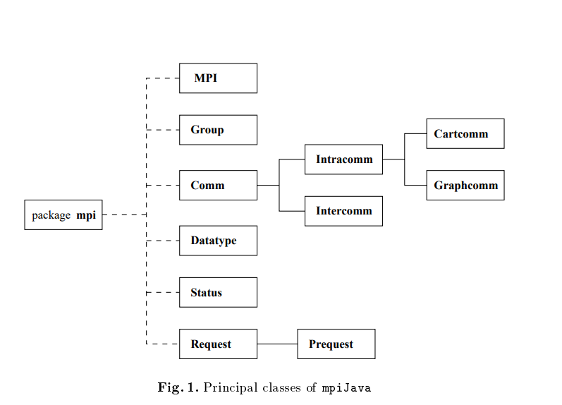
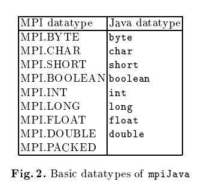
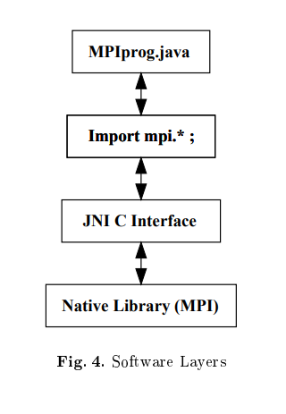

# MPI Like Tools in Java

A basic prerequisite for parallel programming is a good com- munication API and the need for a standardised framework to write parallelized code in a serial coding manner has grown greatly particularly in languages like java that is simple, efficient and platform-neutral.

The article discusses a binding of MPI 1.1 for Java, and describes an implementation using Java wrappers to invoke C MPI calls through the Java Native Interface.

## [MPI Java](https://surface.syr.edu/cgi/viewcontent.cgi?article=1006&context=npac)

This package aims to implement MPI as close to the C/C++ implementation as possible.

### MPI Java Classes



- The diagram above shows the important classes present in the mpiJava package

- **MPI class** : Only has static members. It acts as a module containing global
services, such as initialization of MPI, and many global constants including the default communicator COMM WORLD.

- **Comm class** : All the communication functions are a member of or a subclass of this class. As usual in MPI, a communicator stands for a 'collective object' logically shared by a group of processor.
    
    - The standard send and receive operations of MPI are members of Comm with interfaces: count is number of elements returned. 

        ```
        public void Send(Object buf, int offset, int count, Datatype datatype, int dest, int tag)
    
        public Status Recv(Object buf, int offset, int count, Datatype datatype, int source, int tag)
        
        ```

    - In these and all other mpiJava
calls, the buffer array argument is followed by an offset that specifies the element of in array where the message actually starts.

- **Datatype class** : This describes the type of the elements in the message buffers passed to
send, receive, and all other communication functions.



- Example Program : It sends a simple "Hello there" message to another process which receives it and prints the result.

```
import mpi.*;

class Hello {
    static public void main(String[] args){
        MPI.Init(args);
        int myrank = MPI.COMM_WORLD.Rank();
        
        if(myrank == 0) {
            char [] message = "Hello, there".toCharArray() ;
            MPI.COMM_WORLD.Send(message,0,message.length, MPI.CHAR, 1, 99);
        } 
        else {
            char [] message = new char [20] ;
            MPI.COMM_WORLD.Recv(message, 0, 20, MPI.CHAR, 0, 99) ;
            System.out.println("received:" + new String(message) + ":");
        }
        
        MPI.Finalize();
    }
}

```

### MPI Java Architecture



- JNI : The Java Native Interface (JNI) is a programming framework that allows Java code to call and be called by native applications and libraries. Native applications are programs specific to a hardware and operating system platform. Libraries can be written in other languages such as C, C++, and assembly.  

- To 'port' mpiJava onto a PC environment it is necessary to have a native MPI library,a version of the Java Development Toolkit (JDK) and a C compiler.

- mpiJava consists of two main parts : 
    - The MPI Java classes 
    - C stubs (bindings) that binds the MPI Java classes to the underlying native MPI implementation

- These C stubs using JNI - the means by which Java can call and pass parameters to and from
a native API.


- From the diagram, we can see the various software layers, where the java program imports the mpi library functions from the mpiJava library.

- During compilation the JNI C Interface comes into the picture where the JNI calls the library functions of the native library (MPICH).
