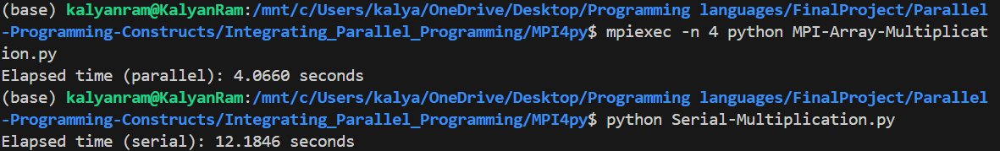
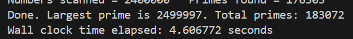
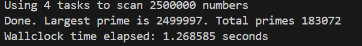

# MPI Tool Implementation in Python

## Overview 

MPI - the Message Passing Interface, is a standardized and portable message-passing system designed to function on a wide variety of parallel computers. The standard defines the syntax and semantics of library routines and allows users to write portable programs in the main scientific programming languages.

The base compiler for mpi programs is the MPICH packages. MPICH, or Message Passing Interface, is a portable, high-performance implementation of the MPI standard for message-passing libraries.

This implementation mainly depends on the OS rather than programming language, so a good knowledge of the underlying Unix commands and its equivalent function calls in a programming language allow for MPI implementation in other languages.


## [MPI For Python - mpi4y](https://mpi4py.readthedocs.io/en/stable/)

MPI for Python provides Python bindings for the Message Passing Interface (MPI) standard, allowing Python applications to exploit multiple processors on workstations, clusters and supercomputers.

It supports point-to-point (sends, receives) and collective (broadcasts, scatters, gathers) communication of any picklable Python object, as well as efficient communication of Python objects exposing the Python buffer interface.

It provides an object oriented approach to message passing which is based on the standard MPI-2 C++ bindings. 

**The interface was designed with focus in translating MPI syntax and semantics of standard MPI-2 bindings for C++ to Python**

### Communicating Python Objects and Array Data

- The pickle modules provide user-extensible facilities to serialize general Python objects using ASCII or binary formats and the marshal module to serialize built-in python objects using a binary format specific to python.

- This module is used to communicate python objects in the binary format while sending and restored while receiving.

### Communicators

- In MPI for Python, Comm is the base class of communicators. The two predefined intracommunicator instances are available: COMM_SELF and COMM_WORLD. It is for defining processes that are involved in message passing

-  Comm.Send, Comm.Recv and Comm.Sendrecv, Comm.Isend and Comm.Irecv are some of the methods present in Communicator to send messages.

- **Point-to-Point Communication** : MPI for python provides a set of send and receive functions allowing the communication of typed data with an associated tag.

- **Blocking Communication** :  Comm.Send, Comm.Recv and Comm.Sendrecv functions can block the caller until the data buffers involved in the communication can be safely reused by the application program.

- **NonBlocking Communication** : The  Comm.Isend and Comm.Irecv methods provide non blocking communication facility which allows for caller/receiver to continue execution without waiting for completion of communication.

- **Collective Communication** : Allow the transmittal of data between multiple processes of a group simultaneously. 

    - In MPI for Python, the Comm.Bcast, Comm.Scatter, Comm.Gather, Comm.Allgather, Comm.Alltoall methods provide support for collective communications of memory buffers. 

    - Global reducion operations on memory buffers are accessible through the Comm.Reduce, Comm.Reduce_scatter, Comm.Allreduce, Intracomm.Scan and Intracomm.Exscan methods.

### Parallel Input/Output

- The POSIX standard lacks optimized support for parallel input/output operations, prompting the development of MPI-2 with custom interfaces for efficient and scalable parallel I/O.

- MPI defines files as ordered collections of typed data items, enabling sequential or random access and collective opening by process groups, enhancing flexibility and expressiveness compared to byte stream models.

- MPI for Python utilizes the File class to perform all I/O operations, including opening, reading, writing, and closing files, with methods for setting/querying data views and various read/write behaviors (e.g., blocking/nonblocking, collective/noncollective).

### Environmental Management

- Module functions Init or Init_thread and Finalize provide MPI initialization and finalization respectively.

- Module functions Is_initialized and Is_finalized provide the respective tests for initialization and finalization.

- The MPI version number can be retrieved from module function Get_version. It returns a two-integer tuple (version, subversion).

- The Get_processor_name function can be used to access the processor name.

- The values of predefined attributes attached to the world communicator can be obtained by calling the Comm.Get_attr method within the COMM_WORLD instance.


### Running MPI for Python 

To install follow the link : https://mpi4py.readthedocs.io/en/stable/install.html

The **mpi4py** module is used to run the MPI for Python features

```
$ mpiexec -n 4 python script.py
```

This command is used to run a program using MPI got python. This command run the program with 4 processors.

The remaining functionalities of MPI Python are explained in the documentation link 


## Comparision of Runtimes

### Matrix Multiplication



- The image above shows the time taken to perform matrix multiplication on 2 500*500 matrix with random values.
- We can see that the MPI program is 3 times faster than running matrix multiplication serially

### Finding Number of Primes and Largest Prime

- Serial

- Parallel


- We can see that the MPI program is almost 4 times faster than the serial program