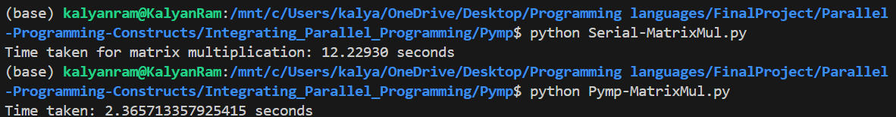

# OpenMP Tools In Python

## Overview

OpenMp is widely used for implementing parallel programming constructs in a local environment/cluster and is considered an industry standard. The OpenMP documentation provides directives and functions only for C/C++ and Fortran. Hence we will look at how OpenMP like tools in python are being developed in other programming languages and try to come to a generalized approach on building programming languages that support parallelism.

## Exploration of tools

### [Pymp](https://www.admin-magazine.com/HPC/Articles/Pymp-OpenMP-like-Python-Programming)

This article describes the implementation of an OpenMP like tool in Python. 

- Pymp aims to bring OpenMp-like functionality by implementing some of the concepts like a single master thread forking multiple threads, sharing data , synchronizing between threads and destroying threads
-  When Pymp Python code hits a parallel region, processes – termed child processes are forked and are in a state that is nearly the same as the “master process.” Here processes are forked instead of threads. The shared memory is referenced by the processes. 
- When a parallel region ends, all the child processes exit and only the master process continues.
- Similar to OpenMp, Pymp also numbers its child processes with the master process having "thread_num 0"
- Example code of using Pymp to define a parallel region : 
```
with pymp.Parallel(4) as p:
  for sec_idx in p.range(4):
    if sec_idx == 0:
      p.print('Section 0')
    elif sec_idx == 1:
      p.print('Section 1')
    ...
```
- The first statement in the code outine defines the parallel construct (start of parallel region and number of processes) and p.range is equivalent to the for directive in OpenMp.
- Environment variables can be used to control vairous aspects of the Pymp code : (Pymp -> OpenMp equivalents)
    - PYMP_NESTED       -> OMP_NESTED
    - PYMP_THREAD_LIMIT -> OMP_THREAD_LIMIT
    - PYMP_NUM_THREADS  -> OMP_NUM_THREADS        

- Other features of Pymp include : 
 - Schedules
 - Variable scopes
 - Nested Loops
 - Exceptions
 - Conditional parallelism
 - Iterables

The implementation makes use of the "multiprocessing.py" library which provides process-based parallelism. Pymp is an abstraction/api that makes it easier write parallel code.

- Schedules : 
    - The basic OpenMP scheduling types map directly to the classical Python ranges: using pymp.range corresponds to the static schedule by returning a complete list of indices, while pymp.xrange returns an iterator and corresponds to dynamic scheduling.

- Variable Scopes : 
    - The implemented variable scopes are firstprivate, shared and private. All variables that are declared before the pymp.Parallel call are implicitly firstprivate, all variables from the pymp.shared module are shared, and all variables created within a pymp. Parallel context are private.
    - In the example below, the shared.array() function defines an array of size 100 that is shared between the processes team. Synchronization needs to be done manually using the **lock** function.

```
ex_array = pymp.shared.array((100,), dtype='uint8')
with pymp.Parallel(4) as p:
    for index in p.range(0, 100):
        ex_array[index] = 1
        # The parallel print function takes care of asynchronous output.
        p.print('Yay! {} done!'.format(index))
```

- Sections: 
    - Pymp doesn't provide any explicit implementation for sections and section , but the behaviour can be produced by using **pymp.range** and **if-else** conditions.

```
with pymp.Parallel(4) as p:
    for sec_idx in p.xrange(4):
        if sec_idx == 0:
            p.print('Section 0')
        elif sec_idx == 1:
            p.print('Section 1')
        ...
```

- [Laplace Solver Example](https://github.com/Vidhish-Trivedi/Parallel-Programming-Constructs/tree/main/Integrating_Parallel_Programming/Laplace_Solver.py)

    - The code implementes a simple laplace solver , which is a method to solve the laplace equation, a second-order partial differential equation. (del^2 f = 0)
    - The code implements a parallelized Jacobi iterative method to solve Laplace's equation on a 2D grid, where each grid point is updated based on the average of its neighboring points until convergence is achieved. It makes use ot the finite differences method.

    | Number of cores | Time Taken (secs) | 
    | :-------------: | :---------: |
    | 1 | 165.0|
    | 2 | 94.0 |
    |4| 11.0 |
    |6| 4.5 |

    - From the table above we can see that Pymp is able to make use multiple processes and synchronize between them to get the solution in a shorter period of time.


Link to implementation and setup of Pymp : https://github.com/classner/pymp

### [PyOMP - Multithreaded Parallel Python Through OpenMP Support in Numba](https://tigress-web.princeton.edu/~jdh4/PyOMPintro.pdf)

- Python is not designed for parallel programming with threads.
The GlobalInterpreterLock (GIL) prevents multiple threads from
simultaneously accessing Python objects. This effectively prevents
data races and makes Python naturally thread safe. 

- The paper implements OpenMP in Python, allowing  programmers to easily annotate code and then let the Numba just-in-time (JIT) compiler
generate multithreaded, OpenMP code in LLVM, thereby bypassing the GIL.

- The JIT compiler aids in improving the performance of programs by compiling bytecode into native machine code at run time.

- Numba is a just-in-time (JIT) compiler for Python that translates a subset of Python and NumPy code into fast machine code. Numba uses the LLVM compiler project to generate machine code from Python syntax. LLVM is a compiler infrastructure project that provides a modular and reusable set of libraries for constructing optimizing compilers.


- PyOMP is a research prototype of a system implementing OpenMP in Python. PyOMP uses the Python **with** statement to expose the
directives in OpenMP.

- These **with** statements are interpreted
by a custom Numba JIT and combined with a backend that
connects these constructs to analogous entry points in the
generated LLVM code. 
- This LLVM code is then compiled
using the Intel LLVM system, which includes support for
the full range of OpenMP constructs.

- The paper focusses on the implementation of the 21 most commly used elements of OpenMp called "OpenMP Common Core"


- Link to PyOMP Implementation and Setup : https://github.com/Python-for-HPC/PyOMP


## Results of Pymp

### Matrix Multiplication



- Here we are performing matrix multiplication of 2 matrices of size 500*500 
- We can see that Pymp is almost 6 times faster than performing matrix multiplicaton serially

### Primes 


- Here we are finding the total number of primes 
- In this figure, we can see that the pymp program is 3 times faster than the serial program


