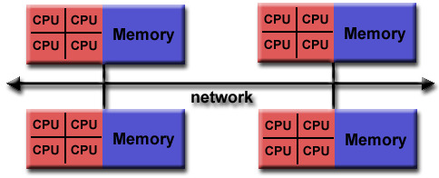

# Introduction to MPI

MPI (Message Passing Interface) is a specification designed for developers and users of message passing libraries. It addresses the message-passing parallel programming model: data is moved from the address space of one process to that of another process through cooperative operations on each process.

Simply stated, the goal of the Message Passing Interface is to provide a widely used standard for writing message passing programs. The interface attempts to be practical, portable, efficient, and flexible.

Originally, MPI was designed for distributed memory architectures, which were becoming increasingly popular at that time (1980s - early 1990s).

As architecture trends changed, shared memory SMPs were combined over networks creating hybrid distributed memory / shared memory systems.

Today, MPI runs on virtually any hardware platform:

- Distributed Memory
- Shared Memory
- Hybrid

The programming model clearly remains a distributed memory model however, regardless of the underlying physical architecture of the machine.

All parallelism is explicit: the programmer is responsible for correctly identifying parallelism and implementing parallel algorithms using MPI constructs.

## Reasons for Using MPI

- **Standardization**: MPI is the only message passing library considered a standard, supported on virtually all HPC platforms.
- **Portability**: Little or no modification of source code is needed when porting applications to different platforms that support the MPI standard.
- **Performance Opportunities**: Vendor implementations can exploit native hardware features for optimized performance.
- **Functionality**: MPI-3 defines over 430 routines, offering extensive functionality for parallel programming.
- **Availability**: Various implementations, both vendor and public domain, are available.

## Format of MPI Calls

MPI calls have a specific format:

#### Communicators and Groups

- **Communicators and Groups:**  
MPI uses objects called communicators and groups to define which collection of processes may communicate with each other.

- **Specifying Communicators:**  
Most MPI routines require you to specify a communicator as an argument. Communicators and groups will be covered in more detail later. Example - MPI_COMM_WORLD - it is the predefined communicator that includes all of your MPI processes.

#### Rank

- **Rank Assignment:**  
Within a communicator, every process has its own unique, integer identifier assigned by the system when the process initializes. A rank is sometimes also called a “task ID”. Ranks are contiguous and begin at zero.

- **Usage of Rank:**  
Used by the programmer to specify the source and destination of messages. Often used conditionally by the application to control program execution (if rank=0 do this / if rank=1 do that).

#### Error Handling

- **Error Codes:**  
Most MPI routines include a return/error code parameter, as described in the “Format of MPI Calls” section above.

- **Default Error Handling:**  
However, according to the MPI standard, the default behavior of an MPI call is to abort if there is an error. This means you will probably not be able to capture a return/error code other than MPI_SUCCESS (zero).

- **Custom Error Handling:**  
The standard does provide a means to override this default error handler. The types of errors displayed to the user are implementation dependent.
