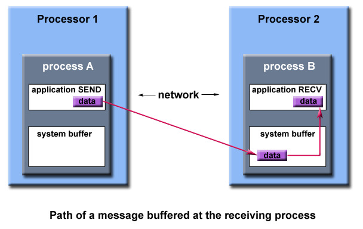

## Point-to-Point Operations in MPI

MPI provides different types of point-to-point operations for message passing between two tasks:

- **Synchronous send**
- **Blocking send / blocking receive**
- **Non-blocking send / non-blocking receive**
- **Buffered send**
- **Combined send/receive**
- **“Ready” send**

### Blocking and Non-Blocking Operations in MPI

#### Blocking Operations

Blocking send/receive routines in MPI are communication operations that block the execution of the sender or receiver until the communication operation is completed. This ensures synchronous and safe data transfer between processes.

In MPI, the most common blocking send and receive routines are:

- MPI_Send: This routine is used by the sender to send a message to a specified destination process. It blocks until the message has been safely buffered for transmission.
- MPI_Recv: This routine is used by the receiver to receive a message from a specified source process. It blocks until a message is available to be received.

Blocking send/receive operations provide a simple and straightforward way to exchange data between processes in MPI, but they can lead to potential inefficiencies in certain scenarios. For example, if the sender and receiver are not synchronized properly, a deadlock may occur where both processes are waiting for each other to send or receive data.

#### Non-Blocking Operations

Non-blocking send/receive routines in MPI allow the sender or receiver to continue executing instructions without waiting for the communication operation to complete. These asynchronous operations return immediately after initiation, enabling overlap of communication with computation for improved performance.

In MPI, the most common non-blocking send and receive routines are:

1. **MPI_Isend**: This routine is used by the sender to initiate a non-blocking send operation. It returns immediately after the send operation is initiated, allowing the sender to continue executing other instructions. The sender must later ensure that the sent data is not modified until the send operation completes.
2. **MPI_Irecv**: This routine is used by the receiver to initiate a non-blocking receive operation. It returns immediately after the receive operation is initiated, allowing the receiver to continue executing other instructions. The receiver must later ensure that the received data is valid and can be safely accessed.

Non-blocking send/receive operations are useful for overlapping communication with computation, which can lead to improved performance, especially in situations where the communication time is significant compared to the computation time. However, it requires careful handling of data to avoid race conditions or data corruption issues. The completion of non-blocking operations can be checked using completion routines like MPI_Wait or MPI_Test.

|                        | Blocking Operations                                | Non-Blocking Operations                             |
|------------------------|----------------------------------------------------|-----------------------------------------------------|
| **Behavior**           | Blocks execution until communication completes.    | Returns almost immediately; execution continues.    |
| **Safety**             | Safe to modify application buffer after return.     | Unsafe to modify application buffer immediately.    |
| **Handshaking**        | May involve handshaking for confirmation.          | No handshaking; requests operation asynchronously. |
| **System Buffer**      | May use system buffer for eventual delivery.       | No system buffer used.                              |
| **Data Arrival**       | Waits for data arrival before returning.           | Does not wait for data arrival.                     |
| **Wait Routines**      | No need for additional wait routines.              | Requires wait routines to ensure completion.        |
| **Primary Use**        | Essential for synchronization and safety.           | Used to overlap computation with communication.     |

#### Blocking Send

```
myvar = 0;

for (i=1; i<ntasks; i++) {
    task = i;
    MPI_Send (&myvar ... ... task ...);
    myvar = myvar + 2;

    /* do some work */
}
```


#### Non - Blocking Send

```
myvar = 0;

for (i=1; i<ntasks; i++) {
    task = i;
    MPI_Isend (&myvar ... ... task ...);
    myvar = myvar + 2;

    /* do some work */

    MPI_Wait (...);
}
```

Blocking sends in MPI ensure that the sender does not proceed with further instructions until the communication operation is completed. This blocking behavior guarantees that the sender's data is safe to be accessed or modified after the send operation returns. Once the send operation completes, the sender can safely reuse or modify the sent data without worrying about potential data corruption.

On the other hand, non-blocking sends in MPI (e.g., MPI_Isend) return immediately after initiating the communication operation without waiting for it to complete. This non-blocking behavior allows the sender to continue executing other instructions while the send operation is in progress. 

<div style="background-color: #ffffcc; border: 1px solid #ccc; padding: 10px; border-radius: 8px; color: black;">
Non-blocking sends in MPI are considered "unsafe" because they do not ensure that the data being sent remains valid until the send operation completes. This can lead to undefined behavior if the data is modified or deallocated before the send operation finishes. It's like trying to mail a letter that you've already thrown away.
</div>


### Order and Fairness

MPI guarantees that messages will not overtake each other.

If a sender sends two messages (Message 1 and Message 2) in succession to the same destination, and both match the same receive, the receive operation will receive Message 1 before Message 2.

If a receiver posts two receives (Receive 1 and Receive 2), in succession, and both are looking for the same message, Receive 1 will receive the message before Receive 2.

Order rules do not apply if there are multiple threads participating in the communication operations.

MPI does not guarantee fairness - it’s up to the programmer to prevent “operation starvation”.

Example: task 0 sends a message to task 2. However, task 1 sends a competing message that matches task 2’s receive. Only one of the sends will complete.

### Buffering in MPI

In a perfect world, every send operation would be perfectly synchronized with its matching receive. This is rarely the case. Somehow or other, the MPI implementation must be able to deal with storing data when the two tasks are out of sync.

Consider the following two cases:

A send operation occurs 5 seconds before the receive is ready - where is the message while the receive is pending?
Multiple sends arrive at the same receiving task which can only accept one send at a time - what happens to the messages that are “backing up”?
The MPI implementation (not the MPI standard) decides what happens to data in these types of cases. Typically, a system buffer area is reserved to hold data in transit. For example:



System buffer space is:

- Opaque to the programmer and managed entirely by the MPI library
- A finite resource that can be easy to exhaust
- Often mysterious and not well documented
- Able to exist on the sending side, the receiving side, or both
- Something that may improve program performance because it allows send-receive operations to be asynchronous.
- User managed address space (i.e. your program variables) is called the application buffer. MPI also provides for a user managed send buffer.

