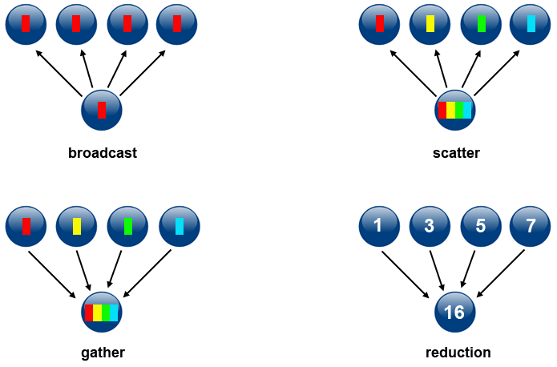
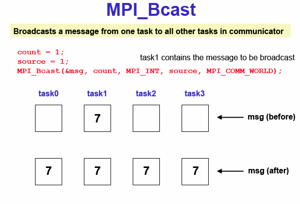
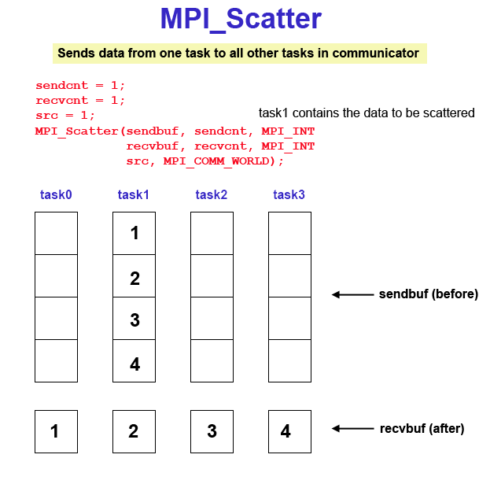
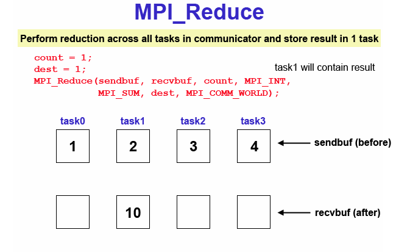
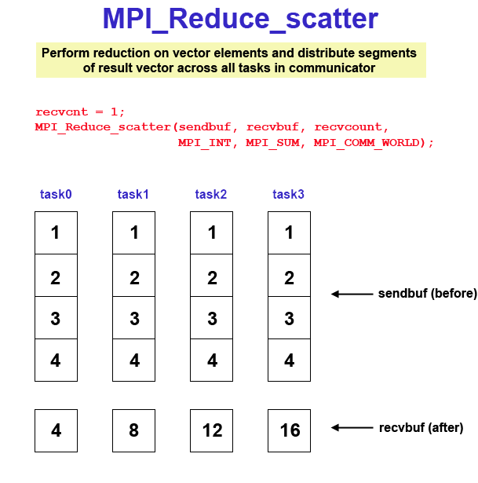
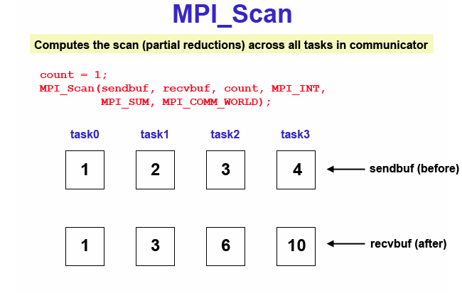

# Collective Communication Routines



#### Types of Collective Operations:

* **Synchronization** - processes wait until all members of the group have reached the synchronization point.
* **Data Movement** - broadcast, scatter/gather, all to all.
* **Collective Computation** (reductions) - one member of the group collects data from the other members and performs an operation (min, max, add, multiply, etc.) on that data.

#### Scope:

Collective communication routines must involve all processes within the scope of a communicator. All processes are by default, members in the communicator MPI_COMM_WORLD. Additional communicators can be defined by the programmer.

Unexpected behavior, including program failure, can occur if even one task in the communicator doesn't participate.

It is the programmer's responsibility to ensure that all processes within a communicator participate in any collective operations.

#### Programming Considerations and Restrictions:

Collective communication routines do not take message tag arguments.

Collective operations within subsets of processes are accomplished by first partitioning the subsets into new groups and then attaching the new groups to new communicators.

Can only be used with MPI predefined datatypes - not with MPI (Derived Data Types, discussed later).

MPI-2 extended most collective operations to allow data movement between intercommunicators (not covered here).

With MPI-3, collective operations can be blocking or non-blocking. Only blocking operations are covered in this tutorial.

### Collective Communication Routines

**MPI_Barrier**

Synchronization operation. Creates a barrier synchronization in a group. Each task, when reaching the MPI_Barrier call, blocks until all tasks in the group reach the same MPI_Barrier call. Then all tasks are free to proceed.

```
MPI_Barrier (comm)
```

**MPI_Bcast**

Data movement operation. Broadcasts (sends) a message from the process with rank "root" to all other processes in the group. 

```
MPI_Bcast (&buffer,count,datatype,root,comm)
```

**MPI_Scatter**

Data movement operation. Distributes distinct messages from a single source task to each task in the group. 

```
MPI_Scatter (&sendbuf,sendcnt,sendtype,&recvbuf,recvcnt,recvtype,root,comm)
```

**MPI_Gather**

Data movement operation. Gathers distinct messages from each task in the group to a single destination task. This routine is the reverse operation of MPI_Scatter.

```
MPI_Gather (&sendbuf,sendcnt,sendtype,&recvbuf,recvcount,recvtype,root,comm)
```

**MPI_Allgather**

Data movement operation. Concatenation of data to all tasks in a group. Each task in the group, in effect, performs a one-to-all broadcasting operation within the group.

```
MPI_Allgather (&sendbuf,sendcount,sendtype,&recvbuf,recvcount,recvtype,comm)
```

**MPI_Reduce**

Collective computation operation. Applies a reduction operation on all tasks in the group and places the result in one task. 

```
MPI_Reduce (&sendbuf,&recvbuf,count,datatype,op,root,comm)
```

<table style="border-collapse:collapse;border-spacing:0" class="tg">
<thead>
  <tr>
    <th style="background-color:#98ABCE;border-color:black;border-style:solid;border-width:1px;font-family:Arial, sans-serif;font-size:14px;font-weight:bold;overflow:hidden;padding:10px 5px;position:-webkit-sticky;position:sticky;text-align:center;top:-1px;vertical-align:top;will-change:transform;word-break:normal" colspan="2">
      <span style="background-color:#98ABCE">MPI Reduction Operation</span>
    </th>
    <th style="background-color:#98ABCE;border-color:black;border-style:solid;border-width:1px;font-family:Arial, sans-serif;font-size:14px;font-weight:bold;overflow:hidden;padding:10px 5px;position:-webkit-sticky;position:sticky;text-align:center;top:-1px;vertical-align:top;will-change:transform;word-break:normal">
      <span style="background-color:#98ABCE">C Data Types</span>
    </th>
  </tr>
</thead>
<tbody>
  <tr>
    <td style="background-color:#F0F5FE;border-color:black;border-style:solid;border-width:1px;font-family:Arial, sans-serif;font-size:14px;font-weight:bold;overflow:hidden;padding:10px 5px;text-align:left;vertical-align:top;word-break:normal">MPI_MAX</td>
    <td style="border-color:black;border-style:solid;border-width:1px;font-family:Arial, sans-serif;font-size:14px;overflow:hidden;padding:10px 5px;text-align:left;vertical-align:top;word-break:normal">maximum</td>
    <td style="border-color:black;border-style:solid;border-width:1px;font-family:Arial, sans-serif;font-size:14px;overflow:hidden;padding:10px 5px;text-align:left;vertical-align:top;word-break:normal">integer, float</td>
  </tr>
  <tr>
    <td style="background-color:#F0F5FE;border-color:black;border-style:solid;border-width:1px;font-family:Arial, sans-serif;font-size:14px;font-weight:bold;overflow:hidden;padding:10px 5px;text-align:left;vertical-align:top;word-break:normal">MPI_MIN</td>
    <td style="border-color:black;border-style:solid;border-width:1px;font-family:Arial, sans-serif;font-size:14px;overflow:hidden;padding:10px 5px;text-align:left;vertical-align:top;word-break:normal">minimum</td>
    <td style="border-color:black;border-style:solid;border-width:1px;font-family:Arial, sans-serif;font-size:14px;overflow:hidden;padding:10px 5px;text-align:left;vertical-align:top;word-break:normal">integer, float</td>
  </tr>
  <tr>
    <td style="background-color:#F0F5FE;border-color:black;border-style:solid;border-width:1px;font-family:Arial, sans-serif;font-size:14px;font-weight:bold;overflow:hidden;padding:10px 5px;text-align:left;vertical-align:top;word-break:normal">MPI_SUM</td>
    <td style="border-color:black;border-style:solid;border-width:1px;font-family:Arial, sans-serif;font-size:14px;overflow:hidden;padding:10px 5px;text-align:left;vertical-align:top;word-break:normal">sum</td>
    <td style="border-color:black;border-style:solid;border-width:1px;font-family:Arial, sans-serif;font-size:14px;overflow:hidden;padding:10px 5px;text-align:left;vertical-align:top;word-break:normal">integer, float</td>
  </tr>
  <tr>
    <td style="background-color:#F0F5FE;border-color:black;border-style:solid;border-width:1px;font-family:Arial, sans-serif;font-size:14px;font-weight:bold;overflow:hidden;padding:10px 5px;text-align:left;vertical-align:top;word-break:normal">MPI_PROD</td>
    <td style="border-color:black;border-style:solid;border-width:1px;font-family:Arial, sans-serif;font-size:14px;overflow:hidden;padding:10px 5px;text-align:left;vertical-align:top;word-break:normal">product</td>
    <td style="border-color:black;border-style:solid;border-width:1px;font-family:Arial, sans-serif;font-size:14px;overflow:hidden;padding:10px 5px;text-align:left;vertical-align:top;word-break:normal">integer, float</td>
  </tr>
  <tr>
    <td style="background-color:#F0F5FE;border-color:black;border-style:solid;border-width:1px;font-family:Arial, sans-serif;font-size:14px;font-weight:bold;overflow:hidden;padding:10px 5px;text-align:left;vertical-align:top;word-break:normal">MPI_LAND</td>
    <td style="border-color:black;border-style:solid;border-width:1px;font-family:Arial, sans-serif;font-size:14px;overflow:hidden;padding:10px 5px;text-align:left;vertical-align:top;word-break:normal">logical AND</td>
    <td style="border-color:black;border-style:solid;border-width:1px;font-family:Arial, sans-serif;font-size:14px;overflow:hidden;padding:10px 5px;text-align:left;vertical-align:top;word-break:normal">integer</td>
  </tr>
  <tr>
    <td style="background-color:#F0F5FE;border-color:black;border-style:solid;border-width:1px;font-family:Arial, sans-serif;font-size:14px;font-weight:bold;overflow:hidden;padding:10px 5px;text-align:left;vertical-align:top;word-break:normal">MPI_BAND</td>
    <td style="border-color:black;border-style:solid;border-width:1px;font-family:Arial, sans-serif;font-size:14px;overflow:hidden;padding:10px 5px;text-align:left;vertical-align:top;word-break:normal">bit-wise AND</td>
    <td style="border-color:black;border-style:solid;border-width:1px;font-family:Arial, sans-serif;font-size:14px;overflow:hidden;padding:10px 5px;text-align:left;vertical-align:top;word-break:normal">integer, MPI_BYTE</td>
  </tr>
  <tr>
    <td style="background-color:#F0F5FE;border-color:black;border-style:solid;border-width:1px;font-family:Arial, sans-serif;font-size:14px;font-weight:bold;overflow:hidden;padding:10px 5px;text-align:left;vertical-align:top;word-break:normal">MPI_LOR</td>
    <td style="border-color:black;border-style:solid;border-width:1px;font-family:Arial, sans-serif;font-size:14px;overflow:hidden;padding:10px 5px;text-align:left;vertical-align:top;word-break:normal">logical OR</td>
    <td style="border-color:black;border-style:solid;border-width:1px;font-family:Arial, sans-serif;font-size:14px;overflow:hidden;padding:10px 5px;text-align:left;vertical-align:top;word-break:normal">integer</td>
  </tr>
  <tr>
    <td style="background-color:#F0F5FE;border-color:black;border-style:solid;border-width:1px;font-family:Arial, sans-serif;font-size:14px;font-weight:bold;overflow:hidden;padding:10px 5px;text-align:left;vertical-align:top;word-break:normal">MPI_BOR</td>
    <td style="border-color:black;border-style:solid;border-width:1px;font-family:Arial, sans-serif;font-size:14px;overflow:hidden;padding:10px 5px;text-align:left;vertical-align:top;word-break:normal">bit-wise OR</td>
    <td style="border-color:black;border-style:solid;border-width:1px;font-family:Arial, sans-serif;font-size:14px;overflow:hidden;padding:10px 5px;text-align:left;vertical-align:top;word-break:normal">integer, MPI_BYTE</td>
  </tr>
  <tr>
    <td style="background-color:#F0F5FE;border-color:black;border-style:solid;border-width:1px;font-family:Arial, sans-serif;font-size:14px;font-weight:bold;overflow:hidden;padding:10px 5px;text-align:left;vertical-align:top;word-break:normal">MPI_LXOR</td>
    <td style="border-color:black;border-style:solid;border-width:1px;font-family:Arial, sans-serif;font-size:14px;overflow:hidden;padding:10px 5px;text-align:left;vertical-align:top;word-break:normal">logical XOR</td>
    <td style="border-color:black;border-style:solid;border-width:1px;font-family:Arial, sans-serif;font-size:14px;overflow:hidden;padding:10px 5px;text-align:left;vertical-align:top;word-break:normal">integer</td>
  </tr>
  <tr>
    <td style="background-color:#F0F5FE;border-color:black;border-style:solid;border-width:1px;font-family:Arial, sans-serif;font-size:14px;font-weight:bold;overflow:hidden;padding:10px 5px;text-align:left;vertical-align:top;word-break:normal">MPI_BXOR</td>
    <td style="border-color:black;border-style:solid;border-width:1px;font-family:Arial, sans-serif;font-size:14px;overflow:hidden;padding:10px 5px;text-align:left;vertical-align:top;word-break:normal">bit-wise XOR</td>
    <td style="border-color:black;border-style:solid;border-width:1px;font-family:Arial, sans-serif;font-size:14px;overflow:hidden;padding:10px 5px;text-align:left;vertical-align:top;word-break:normal">integer, MPI_BYTE</td>
  </tr>
  <tr>
    <td style="background-color:#F0F5FE;border-color:black;border-style:solid;border-width:1px;font-family:Arial, sans-serif;font-size:14px;font-weight:bold;overflow:hidden;padding:10px 5px;text-align:left;vertical-align:top;word-break:normal">MPI_MAXLOC</td>
    <td style="border-color:black;border-style:solid;border-width:1px;font-family:Arial, sans-serif;font-size:14px;overflow:hidden;padding:10px 5px;text-align:left;vertical-align:top;word-break:normal">max value and location</td>
    <td style="border-color:black;border-style:solid;border-width:1px;font-family:Arial, sans-serif;font-size:14px;overflow:hidden;padding:10px 5px;text-align:left;vertical-align:top;word-break:normal">float, double and long double</td>
  </tr>
  <tr>
    <td style="background-color:#F0F5FE;border-color:black;border-style:solid;border-width:1px;font-family:Arial, sans-serif;font-size:14px;font-weight:bold;overflow:hidden;padding:10px 5px;text-align:left;vertical-align:top;word-break:normal">MPI_MINLOC</td>
    <td style="border-color:black;border-style:solid;border-width:1px;font-family:Arial, sans-serif;font-size:14px;overflow:hidden;padding:10px 5px;text-align:left;vertical-align:top;word-break:normal">min value and location</td>
    <td style="border-color:black;border-style:solid;border-width:1px;font-family:Arial, sans-serif;font-size:14px;overflow:hidden;padding:10px 5px;text-align:left;vertical-align:top;word-break:normal">float, double and long double</td>
  </tr>
</tbody>
</table>


**MPI_Allreduce**

Collective computation operation + data movement. Applies a reduction operation and places the result in all tasks in the group. This is equivalent to an MPI_Reduce followed by an MPI_Bcast.

```
MPI_Allreduce (&sendbuf,&recvbuf,count,datatype,op,comm)
```

**MPI_Reduce_scatter**

Collective computation operation + data movement. First does an element-wise reduction on a vector across all tasks in the group. Next, the result vector is split into disjoint segments and distributed across the tasks. This is equivalent to an MPI_Reduce followed by an MPI_Scatter operation. 

```
MPI_Reduce_scatter (&sendbuf,&recvbuf,recvcount,datatype,op,comm)
```

**MPI_Alltoall**

Data movement operation. Each task in a group performs a scatter operation, sending a distinct message to all the tasks in the group in order by index.

```
MPI_Alltoall (&sendbuf,sendcount,sendtype,&recvbuf,recvcnt,recvtype,comm)
```

**MPI_Scan**

Performs a scan operation with respect to a reduction operation across a task group. 

```
MPI_Scan (&sendbuf,&recvbuf,count,datatype,op,comm)
```

### Examples

```
#include "mpi.h"
#include <stdio.h>
#define SIZE 4

main(int argc, char *argv[])  {
int numtasks, rank, sendcount, recvcount, source;
    float sendbuf[SIZE][SIZE] = {
        {1.0, 2.0, 3.0, 4.0},
        {5.0, 6.0, 7.0, 8.0},
        {9.0, 10.0, 11.0, 12.0},
        {13.0, 14.0, 15.0, 16.0}  };
    float recvbuf[SIZE];

    MPI_Init(&argc,&argv);
    MPI_Comm_rank(MPI_COMM_WORLD, &rank);
    MPI_Comm_size(MPI_COMM_WORLD, &numtasks);

    if (numtasks == SIZE) {
        // define source task and elements to send/receive, then perform collective scatter
        source = 1;
        sendcount = SIZE;
        recvcount = SIZE;
        MPI_Scatter(sendbuf,sendcount,MPI_FLOAT,recvbuf,recvcount,
                    MPI_FLOAT,source,MPI_COMM_WORLD);

        printf("rank= %d  Results: %f %f %f %f\n",rank,recvbuf[0],
            recvbuf[1],recvbuf[2],recvbuf[3]);
    }
    else
        printf("Must specify %d processors. Terminating.\n",SIZE);

    MPI_Finalize();
}
```

Sample program output:

```
rank= 0  Results: 1.000000 2.000000 3.000000 4.000000
rank= 1  Results: 5.000000 6.000000 7.000000 8.000000
rank= 2  Results: 9.000000 10.000000 11.000000 12.000000
rank= 3  Results: 13.000000 14.000000 15.000000 16.000000
```
