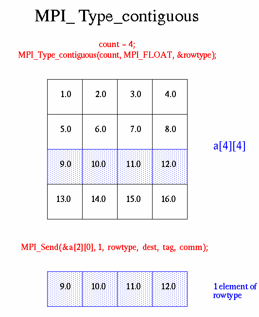
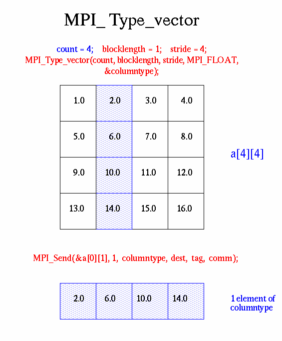
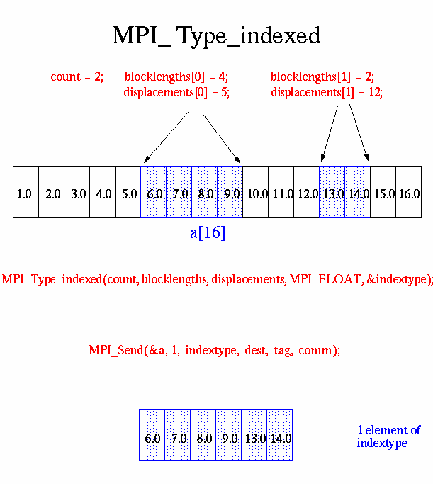
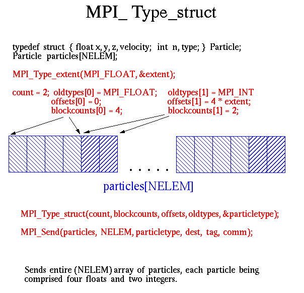

# Derived Data Types

| C Data Types           |                        |
|------------------------|------------------------|
| **MPI_CHAR**           | **MPI_C_BOOL**         |
| **MPI_WCHAR**          | **MPI_C_FLOAT_COMPLEX**|
| **MPI_SHORT**          | **MPI_C_DOUBLE_COMPLEX**|
| **MPI_INT**            | **MPI_C_LONG_DOUBLE_COMPLEX**|
| **MPI_LONG**           | **MPI_BYTE**          |
| **MPI_LONG_LONG_INT**  | **MPI_LOGICAL**       |
| **MPI_LONG_LONG**      | **MPI_C_LONG_DOUBLE_COMPLEX**|
| **MPI_SIGNED_CHAR**    | **MPI_INT8_T**        |
| **MPI_UNSIGNED_CHAR**  | **MPI_INT16_T**       |
| **MPI_UNSIGNED_SHORT** | **MPI_INT32_T**       |
| **MPI_UNSIGNED_LONG**  | **MPI_INT64_T**       |
| **MPI_UNSIGNED**       | **MPI_UINT8_T**       |
| **MPI_FLOAT**          | **MPI_UINT16_T**      |
| **MPI_DOUBLE**         | **MPI_UINT32_T**      |
| **MPI_LONG_DOUBLE**    | **MPI_UINT64_T**      |
| **MPI_C_COMPLEX**      | **MPI_PACKED**          |
-----------------------------------------------------


MPI also provides facilities for defining custom data structures based on sequences of the MPI primitive data types. These user-defined structures are referred to as derived data types.

Derived data types in MPI allow for the creation of non-contiguous data structures conveniently, treating them as if they were contiguous.

There are several methods provided by MPI for constructing derived data types:

- Contiguous
- Vector
- Indexed
- Struct

### Derived Data Type Routines

#### MPI_Type_contiguous

This routine creates a new data type by replicating a given data type a specified number of times. It results in a derived data type where elements are contiguous in memory, akin to an array.

```code
MPI_Type_contiguous(count, oldtype, &newtype)
```

**MPI_Type_vector**

**MPI_Type_hvector**

These routines are similar to MPI_Type_contiguous but allow for regular gaps (stride) in the displacements. MPI_Type_hvector is the same as MPI_Type_vector except that the stride is specified in bytes. 

They enable defining a strided pattern of elements by specifying the displacement between consecutive elements.

```
MPI_Type_vector (count,blocklength,stride,oldtype,&newtype)
```

**MPI_Type_indexed**

**MPI_Type_hindexed**

These routines allow specifying a list of blocks with different sizes and displacements. An array of displacements of the input data type is provided as the map for the new data type. 

MPI_Type_hindexed is similar to MPI_Type_indexed except that offsets are specified in bytes.

```
MPI_Type_indexed (count,blocklens[],offsets[],old_type,&newtype)
```

**MPI_Type_struct**

This routine forms a new data type according to a completely defined map of the component data types. Similar to the C struct type, it allows defining a collection of variables with different data types and offsets.

`**NOTE**: This function is deprecated in MPI-2.0 and replaced by MPI_Type_create_struct in MPI-3.0`

```
MPI_Type_struct (count,blocklens[],offsets[],old_types,&newtype)
```

**MPI_Type_commit**

Commits new datatype to the system. Required for all user constructed (derived) datatypes.

```
MPI_Type_commit (&datatype)
```

**MPI_Type_free**

Deallocates the specified datatype object. Use of this routine is especially important to prevent memory exhaustion if many datatype objects are created, as in a loop.

```
MPI_Type_free (&datatype)
```

### Examples

#### Examples: Contiguous Derived Data Type

Create a data type representing a row of an array and distribute a different row to all processes.



#### Examples: Vector Derived Data Type

Create a data type representing a column of an array and distribute different columns to all processes.



#### Examples: Indexed Derived Data Type

Create a datatype by extracting variable portions of an array and distribute to all tasks.



#### Examples: Struct Derived Data Type

Create a data type that represents a particle and distribute an array of such particles to all processes.


