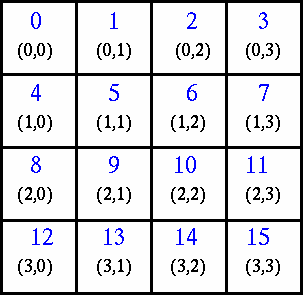

# Virtual Topologies

### What Are They?

In terms of MPI, a virtual topology describes a mapping/ordering of MPI processes into a geometric "shape". Virtual topologies allow processes in a communicator to be organized into a logical structure, such as a one-dimensional array, a two-dimensional grid, or even a more complex graph.

These virtual topologies provide a convenient way to define the communication pattern among processes in a structured manner, which can simplify the development of parallel algorithms.

The two main types of topologies supported by MPI are Cartesian (grid) and Graph.

MPI topologies are virtual - there may be no relation between the physical structure of the parallel machine and the process topology.

Virtual topologies are built upon MPI communicators and groups.

They must be "programmed" by the application developer.

### Why Use Them?

**Convenience**

Virtual topologies may be useful for applications with specific communication patterns - patterns that match an MPI topology structure. For example, a Cartesian topology might prove convenient for an application that requires 4-way nearest neighbor communications for grid based data.

**Communication Efficiency**

Some hardware architectures may impose penalties for communications between successively distant "nodes".

A particular implementation may optimize process mapping based upon the physical characteristics of a given parallel machine.

The mapping of processes into an MPI virtual topology is dependent upon the MPI implementation, and may be totally ignored.

### Example:

A simplified mapping of processes into a Cartesian virtual topology appears below:



MPI provides functions to create and manipulate virtual topologies. The most commonly used functions include:

1. **MPI_Cart_create**: This function creates a Cartesian grid topology. It takes the communicator, number of dimensions, array of the number of processes in each dimension, and an array of periodicity flags as input and returns a new communicator with a Cartesian topology.

2. **MPI_Cart_coords**: Given a rank in a Cartesian communicator, this function returns the coordinates of the process in the grid.

3. **MPI_Cart_rank**: Given the coordinates in a Cartesian communicator, this function returns the rank of the corresponding process in the grid.

4. **MPI_Cart_shift**: Given a direction and a displacement, this function returns the ranks of neighboring processes in the specified direction.

5. **MPI_Graph_create**: This function creates a general graph topology. It takes the communicator, number of nodes, array of node degrees, array of edges, and a flag indicating if the edges are directed or undirected as input and returns a new communicator with a graph topology.

6. **MPI_Dims_create**: This function is used to find a set of dimensions that can be used to decompose a given number of processes into a Cartesian grid.

These functions allow developers to define various communication patterns that suit the problem at hand. For example, a 2D grid topology may be suitable for stencil-based computations, while a graph topology may be appropriate for irregular communication patterns.

Using virtual topologies in MPI can improve the readability, maintainability, and efficiency of parallel programs by encapsulating the communication logic into a structured format.

### Code examples

Create a 4 x 4 Cartesian topology from 16 processors and have each process exchange its rank with four neighbors.

#### Cartesian Virtual Topology Example

```
#include "mpi.h"
#include <stdio.h>
#define SIZE 16
#define UP    0
#define DOWN  1
#define LEFT  2
#define RIGHT 3

int main(int argc, char *argv[])  {
    int numtasks, rank, source, dest, outbuf, i, tag=1,
        inbuf[4]={MPI_PROC_NULL,MPI_PROC_NULL,MPI_PROC_NULL,MPI_PROC_NULL,},
        nbrs[4], dims[2]={4,4},
        periods[2]={0,0}, reorder=0, coords[2];

    MPI_Request reqs[8];
    MPI_Status stats[8];
    MPI_Comm cartcomm;   // required variable

    MPI_Init(&argc,&argv);
    MPI_Comm_size(MPI_COMM_WORLD, &numtasks);

    if (numtasks == SIZE) {
        // create cartesian virtual topology, get rank, coordinates, neighbor ranks
        MPI_Cart_create(MPI_COMM_WORLD, 2, dims, periods, reorder, &cartcomm);
        MPI_Comm_rank(cartcomm, &rank);
        MPI_Cart_coords(cartcomm, rank, 2, coords);
        MPI_Cart_shift(cartcomm, 0, 1, &nbrs[UP], &nbrs[DOWN]);
        MPI_Cart_shift(cartcomm, 1, 1, &nbrs[LEFT], &nbrs[RIGHT]);

        printf("rank= %d coords= %d %d  neighbors(u,d,l,r)= %d %d %d %d\n",
                rank,coords[0],coords[1],nbrs[UP],nbrs[DOWN],nbrs[LEFT],
                nbrs[RIGHT]);

        outbuf = rank;

        // exchange data (rank) with 4 neighbors
        for (i=0; i<4; i++) {
            dest = nbrs[i];
            source = nbrs[i];
            MPI_Isend(&outbuf, 1, MPI_INT, dest, tag,
                    MPI_COMM_WORLD, &reqs[i]);
            MPI_Irecv(&inbuf[i], 1, MPI_INT, source, tag,
                    MPI_COMM_WORLD, &reqs[i+4]);
        }

        MPI_Waitall(8, reqs, stats);

        printf("rank= %d \t\t\t\t inbuf(u,d,l,r)= %d %d %d %d\n",rank,inbuf[UP],inbuf[DOWN],inbuf[LEFT],inbuf[RIGHT]);  
    }
    else
        printf("Must specify %d processors. Terminating.\n",SIZE);

    MPI_Finalize();
}
```

Sample program output: (partial)

```
rank=   0 coords=  0 0 neighbors(u,d,l,r)=  -1  4 -1  1
rank=   0                  inbuf(u,d,l,r)=  -1  4 -1  1
rank=   8 coords=  2 0 neighbors(u,d,l,r)=   4 12 -1  9
rank=   8                  inbuf(u,d,l,r)=   4 12 -1  9
rank=   1 coords=  0 1 neighbors(u,d,l,r)=  -1  5  0  2
rank=   1                  inbuf(u,d,l,r)=  -1  5  0  2
rank=  13 coords=  3 1 neighbors(u,d,l,r)=   9 -1 12 14
rank=  13                  inbuf(u,d,l,r)=   9 -1 12 14
...
...
rank=   3 coords=  0 3 neighbors(u,d,l,r)=  -1  7  2 -1
rank=   3                  inbuf(u,d,l,r)=  -1  7  2 -1
rank=  11 coords=  2 3 neighbors(u,d,l,r)=   7 15 10 -1
rank=  11                  inbuf(u,d,l,r)=   7 15 10 -1
rank=  10 coords=  2 2 neighbors(u,d,l,r)=   6 14  9 11
rank=  10                  inbuf(u,d,l,r)=   6 14  9 11
rank=   9 coords=  2 1 neighbors(u,d,l,r)=   5 13  8 10
rank=   9                  inbuf(u,d,l,r)=   5 13  8 10
```
