# An Overview Of Parallel Programming
[Introduction to Parallel Computing Tutorial | HPC @ LLNL](https://hpc.llnl.gov/documentation/tutorials/introduction-parallel-computing-tutorial##Whatis)

---
## What is Parallel Computing?
**Serial Computing:** Traditionally, software has been written for serial computing.
- A problem is broken into a discrete series of instructions.
- These instructions are executed serially one after another on a single processor, with only one instruction executing at any moment in time.

**Parallel Computing:** is the simultaneous use of multiple compute resources to solve a computational problem.
- A problem is broken into discrete parts that can be solved concurrently.
- Each part is further broken down to a series of instructions, and each such set of instructions executes simultaneously on different processors/threads/compute resources.
- An overall control/coordination mechanism is employed.

**Requirements for a Computational Problem to be solved in Parallel:**
- Be broken apart into discrete pieces of work that can be solved simultaneously;
- Execute multiple program instructions at any moment in time;
- Be solved in less time with multiple compute resources than with a single compute resource (typically a single computer with multiple processors/cores, or an arbitrary number of such computers connected by a network).

Virtually all stand-alone computers today are parallel from a hardware perspective (multi-cores, hardware threads, etc). Networks connect multiple stand-alone computers (called nodes) to make larger parallel computer clusters.

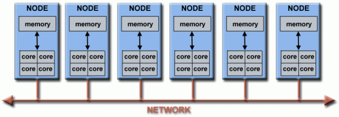

## Why Parallel Computing?
- In the natural world, many complex, **interrelated events** are happening at the same time, yet within a temporal sequence. Compared to serial computing, parallel computing is much better suited for modeling, simulating and understanding complex, real world phenomena (see: [Grand Challenges - Wikipedia](https://en.wikipedia.org/wiki/Grand_Challenges)).
- Parallel computing can lead to **efficient computation** (both in terms of memory and time). It also provides concurrency.
- Many **problems are so large and/or complex** that it is impractical or impossible to solve them using a serial program, especially given limited computer memory. An example: Search engines processing millions of transactions every second.
- Access to non-local resources by using compute resources on a wide area network, or even the Internet when local compute resources are scarce or insufficient.
- Modern computers, even laptops, are parallel in architecture with multiple processors/cores. Parallel software is specifically intended for parallel hardware with multiple cores, threads, etc. Serial programs which run on modern computers may "waste" potential computing power.
## Where is Parallel Computing?
**Science and Engineering:** Atmosphere, Physics (applied, nuclear, fluids, condensed matter), Bioscience, Genetics, Seismology, Aerospace, and many more.
**Industrial and Commercial:** Big Data, Data Mining, Artificial Intelligence, Financial Computing, Graphics, and more.

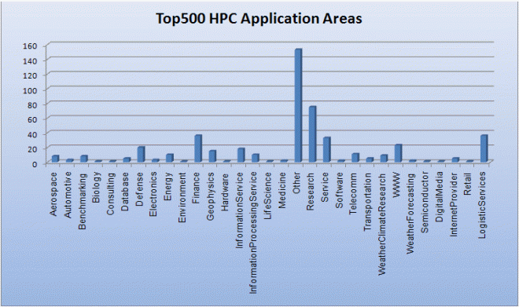

# Concepts and Terminology
## von Neumann Computer Architecture
- Also known as "stored-program computer" - both program instructions and data are kept in electronic memory.
- Four main components:
	- Memory
	- Control Unit
	- ALU - Arithmetic Logic Unit
	- I/O
## Flynn's Classical Taxonomy
Flynn's taxonomy distinguishes multi-processor computer architectures according to how they can be classified along the two independent dimensions of **_Instruction Stream_** and _**Data Stream**_. Each of these dimensions can have only one of two possible states: _**Single**_ or _**Multiple**_

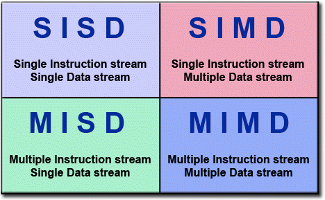

### Single Instruction, Single Data (SISD)
- A serial (non-parallel) computer
- **Single Instruction:** Only one instruction stream is being acted on by the CPU during any one clock cycle
- **Single Data:** Only one data stream is being used as input during any one clock cycle
- Deterministic execution
- This is the oldest type of computer.

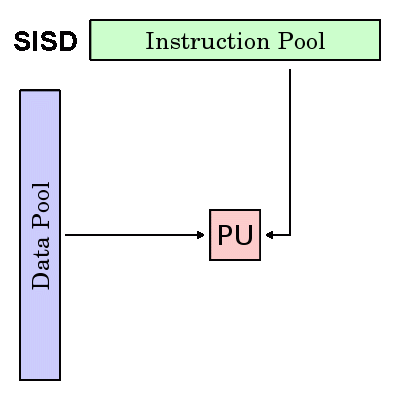

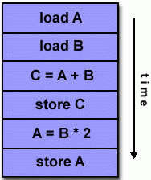

### Single Instruction, Multiple Data (SIMD)
- A type of parallel computer.
- **Single Instruction:** All processing units execute the same instruction at any given clock cycle.
- **Multiple Data:** Each processing unit can operate on a different data element.
- Best suited for specialized problems characterized by a high degree of regularity, such as graphics/image processing.
- Synchronous (lockstep) and deterministic execution.
- Two varieties: Processor Arrays and Vector Pipelines.
- Employed in GPUs

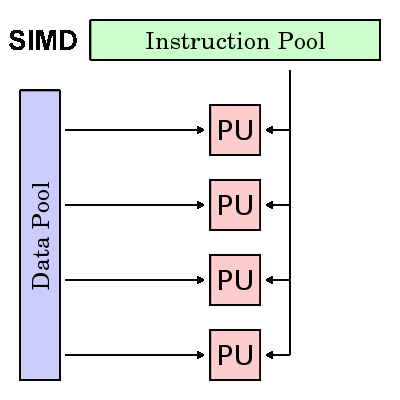

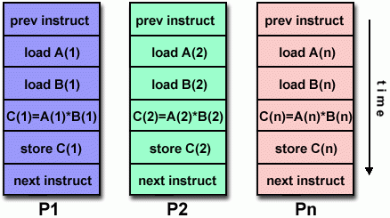

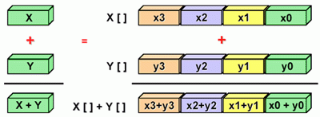

### Multiple Instruction, Single Data (MISD)
- A type of parallel computer
- **Multiple Instruction:** Each processing unit operates on the data independently via separate instruction streams.
- **Single Data:** A single data stream is fed into multiple processing units.
- Few (if any) actual examples of this class of parallel computer have ever existed.
- Some conceivable uses might be:
    - multiple frequency filters operating on a single signal stream
    - multiple cryptography algorithms attempting to crack a single coded message

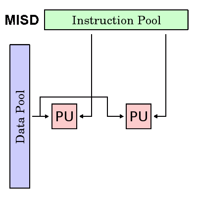

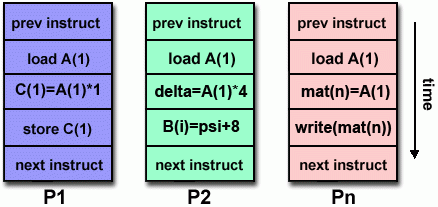

### Multiple Instruction, Multiple Data (MIMD)
- A type of parallel computer
- **Multiple Instruction:** Every processor may be executing a different instruction stream
- **Multiple Data:** Every processor may be working with a different data stream
- Execution can be synchronous or asynchronous, deterministic or non-deterministic
- Currently, the most common type of parallel computer - most modern supercomputers fall into this category.
- Examples: most current supercomputers, networked parallel computer clusters and "grids", multi-processor SMP computers, multi-core PCs.
- Many MIMD architectures also include SIMD execution sub-components.

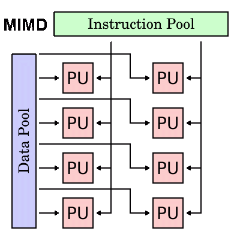

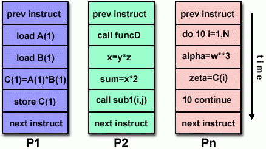

## Terminology
##### CPU
Contemporary CPUs consist of one or more cores - a distinct execution unit with its own instruction stream. Cores with a CPU may be organized into one or more sockets - each socket with its own distinct memory . When a CPU consists of two or more sockets, usually hardware infrastructure supports memory sharing across sockets.
##### Node
A standalone "computer in a box." Usually comprised of multiple CPUs/processors/cores, memory, network interfaces, etc. Nodes are networked together to comprise a supercomputer.
##### Task
A logically discrete section of computational work. A task is typically a program or program-like set of instructions that is executed by a processor. A parallel program consists of multiple tasks running on multiple processors.
##### Pipelining
Breaking a task into steps performed by different processor units, with inputs streaming through, much like an assembly line; a type of parallel computing.
##### Shared Memory
Describes a computer architecture where all processors have direct access to common physical memory. In a programming sense, it describes a model where parallel tasks all have the same "picture" of memory and can directly address and access the same logical memory locations regardless of where the physical memory actually exists.
##### Symmetric Multi-Processor (SMP)
Shared memory hardware architecture where multiple processors share a single address space and have equal access to all resources - memory, disk, etc.
##### Distributed Memory
In hardware, refers to network based memory access for physical memory that is not common. As a programming model, tasks can only logically "see" local machine memory and must use communications to access memory on other machines where other tasks are executing.
##### Communications
Parallel tasks typically need to exchange data. There are several ways this can be accomplished, such as through a shared memory bus or over a network.
##### Synchronization
The coordination of parallel tasks in real time, very often associated with communications.
Synchronization usually involves waiting by at least one task, and can therefore cause a parallel application's wall clock execution time to increase.
##### Computational Granularity
In parallel computing, granularity is a quantitative or qualitative measure of the ratio of computation to communication.
- _**Coarse:**_ relatively large amounts of computational work are done between communication events
- **_Fine:_** relatively small amounts of computational work are done between communication events
##### Parallel Overhead
Required execution time that is unique to parallel tasks, as opposed to that for doing useful work. Parallel overhead can include factors such as:
- Task start-up time
- Synchronizations
- Data communications
- Software overhead imposed by parallel languages, libraries, operating system, etc.
- Task termination time
##### Massively Parallel
Refers to the hardware that comprises a given parallel system - having many processing elements. The meaning of "many" keeps increasing, but currently, the largest parallel computers are comprised of processing elements numbering in the hundreds of thousands to millions.
##### Embarrassingly (IDEALY) Parallel
Solving many similar, but independent tasks simultaneously; little to no need for coordination between the tasks.
##### Scalability
Refers to a parallel system's (hardware and/or software) ability to demonstrate a proportionate increase in parallel speedup with the addition of more resources. Factors that contribute to scalability include:
- Hardware - particularly memory-cpu bandwidths and network communication properties
- Application algorithm
- Parallel overhead related
- Characteristics of your specific application
##### Observed Speedup
Observed speedup of a code which has been parallelized, defined as:

$\text{wall-clock time of serial execution}/\text{wall-clock time of parallel execution}$
# Parallel Computer Memory Architectures
## Shared Memory
- Ability for all processors to access all memory as global address space.
- Multiple processors can operate independently but share the same memory resources.
- Changes in a memory location effected by one processor are visible to all other processors.
- Historically, shared memory machines have been classified as **UMA** and **NUMA**, based upon memory access times.
### Uniform Memory Access (UMA)
- Most commonly represented today by **Symmetric Multiprocessor (SMP)** machines
- Identical processors
- Equal access and access times to memory
- Sometimes called CC-UMA - Cache Coherent UMA. Cache coherent means if one processor updates a location in shared memory, all the other processors know about the update. Cache coherency is accomplished at the hardware level.

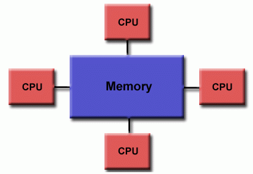

### Non-Uniform Memory Access (NUMA)
- Often made by physically linking two or more SMPs
- One SMP can directly access memory of another SMP
- Not all processors have equal access time to all memories
- Memory access across link is slower
- If cache coherency is maintained, then may also be called CC-NUMA - Cache Coherent NUMA

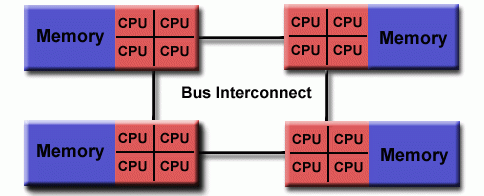

#### Advantages
- Global address space provides a user-friendly programming perspective to memory
- Data sharing between tasks is both fast and uniform due to the proximity of memory to CPUs
#### Disadvantages
- Primary disadvantage is the lack of scalability between memory and CPUs. Adding more CPUs can geometrically increases traffic on the shared memory-CPU path, and for cache coherent systems, geometrically increase traffic associated with cache/memory management.
- Programmer responsibility for synchronization constructs that ensure "correct" access of global memory.
## Distributed Memory
- Distributed memory systems vary widely but share a common characteristic. Distributed memory systems require a communication network to connect inter-processor memory.
- Processors have their own local memory. Memory addresses in one processor do not map to another processor, so there is no concept of global address space across all processors.
- Because each processor has its own local memory, it operates independently. Changes it makes to its local memory have no effect on the memory of other processors. Hence, the concept of cache coherency does not apply.
- When a processor needs access to data in another processor, it is usually the task of the programmer to explicitly define how and when data is communicated. Synchronization between tasks is likewise the programmer's responsibility.
- The network "fabric" used for data transfer varies widely, though it can be as simple as Ethernet.

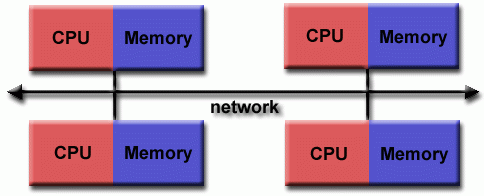

#### Advantages
- Memory is scalable with the number of processors. Increase the number of processors and the size of memory increases proportionately.
- Each processor can rapidly access its own memory without interference and without the overhead incurred with trying to maintain global cache coherency.
- Cost effectiveness: can use commodity, off-the-shelf processors and networking.
#### Disadvantages
- The programmer is responsible for many of the details associated with data communication between processors.
- It may be difficult to map existing data structures, based on global memory, to this memory organization.
- Non-uniform memory access times - data residing on a remote node takes longer to access than node local data.
## Hybrid Distributed-Shared Memory
- The shared memory component can be a shared memory machine and/or graphics processing units (GPU).
- The distributed memory component is the networking of multiple shared memory/GPU machines, which know only about their own memory - not the memory on another machine. Therefore, network communications are required to move data from one machine to another.
- Current trends seem to indicate that this type of memory architecture will continue to prevail and increase at the high end of computing for the foreseeable future.

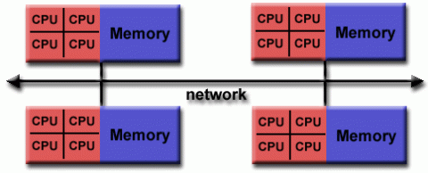

OR

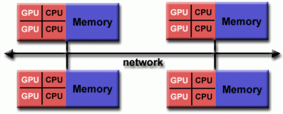

#### Advantages and Disadvantages
- Whatever is common to both shared and distributed memory architectures.
- Increased scalability is an important advantage
- Increased programmer complexity is an important disadvantage
# Parallel Programming Models
- There are several parallel programming models in common use:
    - Shared Memory (without threads)
    - Threads
    - Distributed Memory / Message Passing
    - Data Parallel
    - Hybrid
    - Single Program Multiple Data (SPMD)
    - Multiple Program Multiple Data (MPMD)
- **Parallel programming models exist as an abstraction above hardware and memory architectures.**
- Although it might not seem apparent, these models are **NOT** specific to a particular type of machine or memory architecture. In fact, any of these models can (theoretically) be implemented on any underlying hardware.
