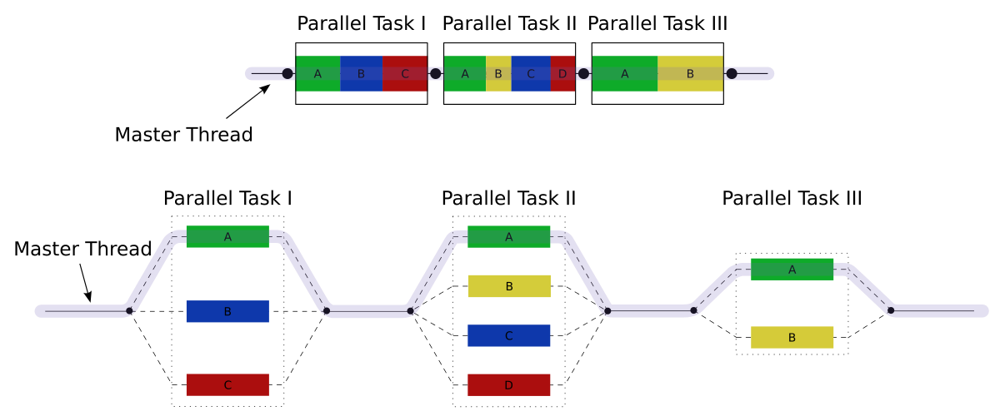

# Diving Deeper Into OpenMP
- Open Multi-Processing (**Open** specifications for **Multi-Processing** via collaborative work between interested parties from the hardware and software industry, government and academia).
- An Application Program Interface (API) that may be used to explicitly direct **_multi-threaded, shared memory parallelism_**
- Comprised of three primary API components (as of version 4.0):
    - Compiler Directives
    - Runtime Library Routines
    - Environment Variables

## Goals of OpenMP
- **Standardization**:
    - Provide a standard among a variety of shared memory architectures/platforms.
    - Jointly defined and endorsed by a group of major computer hardware and software vendors.
- **Lightweight**:
    - Establish a simple and limited set of directives for programming shared memory machines.
    - Significant parallelism can be implemented by using just 3 or 4 directives.
    - This goal is becoming less meaningful with each new release, apparently.
- **Easy to Use**:
    - Provide capability to incrementally parallelize a serial program, unlike message-passing libraries which typically require an all or nothing approach.
    - Provide the capability to implement both coarse-grain and fine-grain parallelism.
- **Portability**:
    - The API is specified for C/C++ and Fortran.
    - Most major platforms have been implemented including Unix/Linux platforms and Windows.

## OpenMP API Overview
We give an overview of the OpenMP API below, these will be covered in more detail in later sections.
### Compiler Directives
Compiler directives appear as comments in your source code and are ignored by compilers unless you tell them otherwise - usually by specifying the appropriate compiler flag (in our case, the `-fopenmp` flag).

General syntax: `sentinel    directive-name    [clause, ...]`

They can be used to:
- Spawn a parallel region
- Divide blocks of code among threads
- Distribute loop iterations between threads
- Serialize sections of code
- Synchronize of work among threads
### Runtime Library Routines
Routines are used to:
- Set and query the number of threads
- Query a thread’s unique identifier (thread ID), a thread’s ancestor’s identifier, the thread team size
- Set and query the dynamic threads feature
- Query if in a parallel region, and at what level
- Set and query nested parallelism
- Set, initialize and terminate locks and nested locks
- Query wall clock time and resolution
For C/C++, all of the run-time library routines are actual subroutines. For Fortran, some are actually functions, and some are subroutines.
### Environment Variables
OpenMP provides several environment variables for controlling the execution of parallel code at run-time. These environment variables can be used to control things such as:
- Setting the number of threads
- Specifying how loop iterations are divided
- Binding threads to processors
- Enabling/disabling nested parallelism; setting the maximum levels of nested parallelism
- Enabling/disabling dynamic threads
- Setting thread stack size
- Setting thread wait policy

These are set like any other environment variable is, and depends on what shell one uses.

## OpenMP Programming Model
### Shared Memory Model
OpenMP is designed for multi-processor/core, shared memory machines. The underlying architecture can be shared memory UMA or NUMA.
### OpenMP Execution Model
#### Thread Based Parallelism
OpenMP programs accomplish parallelism exclusively through the use of threads.

A thread of execution is the smallest unit of processing that can be scheduled by an operating system. They can be thought of as *functions in execution* (similar to how a process can be thought of as a *program in execution*).
Threads exist within the resources of a single process. Without the process, they cease to exist.
Typically, the number of threads match the number of machine processors/cores. However, the actual use of threads is up to the application.
#### Explicit Parallelism
OpenMP is an explicit (not automatic) programming model, offering the programmer full control over parallelization.
#### Fork-Join Model

(credits: Wikipedia)
- All OpenMP programs begin as a single process: the **master thread**. The master thread executes sequentially until the first **parallel region** construct is encountered.
- **FORK**: the master thread then creates a team of parallel _threads_. The statements in the program that are enclosed by the parallel region construct are then executed in parallel among the various team threads.
- **JOIN**: When the team threads complete the statements in the parallel region construct, they synchronize and terminate, leaving only the master thread.

The number of parallel regions and the threads that comprise them are arbitrary.
### Interaction Between Execution Model And Memory Model
**Single-Program-Multiple-Data (SPMD)** is underlying programming paradigm - all threads have potential to execute the same program code, however, each thread may access modify different data and traverse different execution paths.

OpenMP provides a “relaxed-consistency” and “temporary” view of thread memory where threads have equal access to shared memory where variables can be retrieved/stored. Each thread also has its own temporary copies of variables that may be modified independent from variables in memory.

When it is critical that all threads have a consistent view of a shared variable, the programmer (or compiler) is responsible for insuring that the variable is updated by all threads as needed, via an explicit action (FLUSH), or implicitly (via compiler recognition of program flow leaving a parallel regions).

### General Comments
Most OpenMP parallelism is specified through the use of compiler directives which are embedded in C/C++ or Fortran source code (we shall use C/C++ for the majority of this part of the project). The API provides for the placement of parallel regions inside other parallel regions **(Nested Parallelization)**, but different implementations may or may not support this feature.

The API also allows the runtime environment to dynamically alter the number of threads used to execute parallel regions. Which can in turn lead to efficient use of resources. Again, different implementations may or may not support this feature.

OpenMP specifies nothing about parallel I/O. It is entirely up to the programmer to ensure that I/O is conducted correctly within the context of a multi-threaded program.
