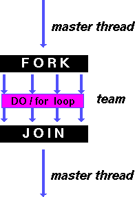
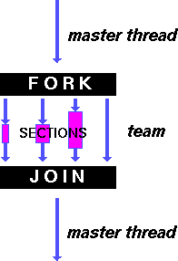
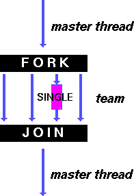

# Work-Sharing Constructs
A work-sharing construct divides the execution of the enclosed code region among the members of the team that encounter it.
Work-sharing constructs do not launch new threads.
There is no implied `barrier` upon entry to a work-sharing construct, however there is an implied `barrier` at the end of a work sharing construct.
## Types of Work-Sharing Constructs
### DO/for
DO/for shares the iterations of a loop across the team (represents a type of "data parallelism").



(Credit: Lawrence Livermore National Laboratory)

The DO / for directive specifies that the iterations of the loop immediately following it must be executed in parallel by the team. This assumes a parallel region has already been initiated, otherwise it executes in serial on a single processor.
#### Format
```c++
#pragma omp for [clause ...]
                schedule (type [,chunk]) 
                ordered
                private (list) 
                firstprivate (list) 
                lastprivate (list) 
                shared (list) 
                reduction (operator: list) 
                collapse (n) 
                nowait

   for_loop
```
#### Clauses
##### SCHEDULE
Describes how iterations of the loop are divided among the threads in the team. The default schedule is implementation dependent.
###### STATIC
Loop iterations are divided into pieces of size chunk and then statically assigned to threads. If chunk is not specified, the iterations are evenly (if possible) divided contiguously among the threads.
###### DYNAMIC
Loop iterations are divided into pieces of size chunk, and dynamically scheduled among the threads; when a thread finishes one chunk, it is dynamically assigned another. The default chunk size is 1.
###### GUIDED
Iterations are dynamically assigned to threads in blocks as threads request them until no blocks remain to be assigned. Similar to DYNAMIC except that the block size decreases each time a parcel of work is given to a thread. The size of the initial block is proportional to:

`number_of_iterations / number_of_threads`

Subsequent blocks are proportional to

`number_of_iterations_remaining / number_of_threads`

The chunk parameter defines the minimum block size. The default chunk size is 1.
###### RUNTIME
The scheduling decision is deferred until runtime by the environment variable OMP_SCHEDULE. It is illegal to specify a chunk size for this clause.
###### AUTO
The scheduling decision is delegated to the compiler and/or runtime system.
##### NO WAIT / nowait
If specified, then threads do not synchronize at the end of the parallel loop.
###### ORDERED
Specifies that the iterations of the loop must be executed as they would be in a serial program.
###### COLLAPSE
Specifies how many loops in a nested loop should be collapsed into one large iteration space and divided according to the schedule clause. The sequential execution of the iterations in all associated loops determines the order of the iterations in the collapsed iteration space.

We will describe other clauses in detail later.
##### General Rules
The DO loop can not be a DO WHILE loop, or a loop without loop control. Also, the loop iteration variable must be an integer and the loop control parameters must be the same for all threads.

Program correctness must not depend upon which thread executes a particular iteration.

It is illegal to branch (goto) out of a loop associated with a DO/for directive.

The chunk size must be specified as a loop invariant integer expression (it should not change between different iterations), as there is no synchronization during its evaluation by different threads.

ORDERED, COLLAPSE and SCHEDULE clauses may appear once each.
##### Example
Element-wise addition of two arrays.
```c++
// In a file called "do_for.cpp"
#include <stdio.h>
#include <omp.h>
#define CHUNKSIZE 100
#define N     1000

int main () {
        int i, chunk;
        float a[N], b[N], c[N];

	    // Initialization
        for (i=0; i < N; i++) {
                a[i] = b[i] = i * 1.0;
        }
        chunk = CHUNKSIZE;

        #pragma omp parallel shared(a, b, c, chunk) private(i)
        {

                #pragma omp for schedule(dynamic, chunk) nowait
                for (i=0; i < N; i++) {
                        c[i] = a[i] + b[i];
                }

        }  // end of parallel section
        return 0;
} 
```
##### Explanation
1. **Parallel Region**:
```c++
#pragma omp parallel shared(a, b, c, chunk) private(i) 
```
- This pragma creates a parallel region where the work is divided among multiple threads.
- `shared(a, b, c, chunk)` specifies that arrays `a`, `b`, `c`, and variable `chunk` are shared among all threads.
- `private(i)` specifies that each thread will have its own private copy of the loop counter `i`.

2. **Parallel Loop**:
```c++
#pragma omp for schedule(dynamic, chunk) nowait         
for (i = 0; i < N; i++) {
	c[i] = a[i] + b[i];
}
```

- This pragma distributes the iterations of the loop among the available threads.
- `schedule(dynamic, chunk)` indicates that loop iterations are scheduled dynamically, with a chunk size of `chunk`.
- `nowait` specifies that threads don't need to wait at the end of the loop.
- Inside the loop, each thread calculates `c[i] = a[i] + b[i]`.
### SECTIONS
SECTIONS breaks work into separate, discrete sections. Each section is executed by a thread. Can be used to implement a type of “functional parallelism”.



(Credit: Lawrence Livermore National Laboratory)

The `SECTIONS` directive is a non-iterative work-sharing construct. It specifies that the enclosed section(s) of code are to be divided among the threads in the team.

Independent `SECTION` directives are nested within a `SECTIONS` directive. Each `SECTION` is executed once by a thread in the team. Different sections may be executed by different threads. It is possible for a thread to execute more than one section if it is quick enough and the implementation permits such.
#### Format
```c++
#pragma omp sections _[clause ...]
                     private _(list)_ 
                     firstprivate _(list)_ 
                     lastprivate _(list)_ 
                     reduction _(operator: list)_ 
                     nowait
  {

  #pragma omp section 
     structured_block_

  #pragma omp section 
     structured_block_
  }
```
**Note:** There is an implied barrier at the end of a SECTIONS directive, unless the NOWAIT/nowait clause is used.

What happens when the number of threads and the number of `SECTIONS` are different:
1. **More threads than SECTIONS**:
    - If there are more threads than `SECTIONS`, some threads will remain idle while executing the `SECTIONS`. Each section will be executed by a separate thread until all sections are executed. The excess threads will not have any work to do and will typically wait idly until the parallel region is completed.
2. **Less threads than SECTIONS**:
    - If there are fewer threads than `SECTIONS`, then not all sections will have a thread assigned to execute them. In this case, some sections will be executed by the available threads in a round-robin manner until all sections are executed. After that, some threads will be idle without any work to do.
As for which thread executes which `SECTION`, OpenMP typically uses a default scheduling algorithm where threads are assigned sections sequentially in the order they appear in the code. However, the exact assignment may vary based on the underlying OpenMP implementation and scheduling policies. If a specific scheduling strategy is desired, it can be explicitly specified using OpenMP directives such as `SCHEDULE` or `NOWAIT`.
##### Example
Simple program demonstrating that different blocks of work will be done by different threads.
```c++
// In a file called "sections.cpp"
#include <stdio.h>
#include <omp.h>
#define N 1000

int main() {
    int i;
    float a[N], b[N], c[N], d[N];

    // Initialization
    for (i = 0; i < N; i++) {
        a[i] = i * 1.5;
        b[i] = i + 22.35;
    }

    #pragma omp parallel shared(a, b, c, d) private(i)
    {
        #pragma omp sections nowait
        {
            #pragma omp section
            for (i = 0; i < N; i++) {
                c[i] = a[i] + b[i];
            }

            #pragma omp section
            for (i = 0; i < N; i++) {
                d[i] = a[i] * b[i];
            }
        } // end of sections
    } // end of parallel section
    return 0;
}
```
##### Explanation
1. **Parallel Region**:    
```c++
#pragma omp parallel shared(a, b, c, d) private(i) 
```
- This pragma creates a parallel region where the work is divided among multiple threads.
- `shared(a, b, c, d)` specifies that arrays `a`, `b`, `c`, and `d` are shared among all threads.
- `private(i)` specifies that each thread will have its own private copy of the loop counter `i`.

2. **Sections Directive**:
```c++
#pragma omp sections nowait
```
- This pragma divides the following block into separate sections that can be executed by different threads.
- `nowait` specifies that threads don't need to wait at the end of the sections block.

3. **First Section - Element-wise Addition**:
```c++
#pragma omp section
for (i = 0; i < N; i++) {
	c[i] = a[i] + b[i];
}
```
- This section calculates element-wise addition of arrays `a` and `b` and stores the result in array `c`.

4. **Second Section - Element-wise Multiplication**:
```c++
#pragma omp section
for (i = 0; i < N; i++) {
	d[i] = a[i] * b[i];
}
```
- This section calculates element-wise multiplication of arrays `a` and `b` and stores the result in array `d`.
##### General Rules
It is illegal to branch (goto) into or out of section blocks.

`SECTION` directives must occur within the lexical extent of an enclosing `SECTIONS` directive (no orphan `SECTION`s). **Please read this line carefully!**

### SINGLE
SINGLE serializes a section of code.



(Credit: Lawrence Livermore National Laboratory)

The SINGLE directive specifies that the enclosed code is to be executed by only one thread in the team. May be useful when dealing with sections of code that are not thread safe (such as I/O).
#### Format
```c++
#pragma omp single _[clause ...] 
                   private _(list)_ 
                   firstprivate _(list)_ 
                   nowait

_structured_block_
```

**Note:** Threads in the team that do not execute the SINGLE directive, wait at the end of the enclosed code block, unless a NOWAIT/nowait clause is specified.
##### General Rules
It is illegal to branch (goto) into or out of a `SINGLE` block.
### WORKSHARE
There is another OpenMP work-sharing construct, known as the workshare directive. It is available only in Fortran, and we are skipping it for now. 
## Some General Rules For All Work Sharing Constructs
- A work-sharing construct must be enclosed dynamically within a parallel region in order for the directive to execute in parallel.
- Work-sharing constructs must be encountered by all members of a team or none at all.
- Successive work-sharing constructs must be encountered in the same order by all members of a team.

These rules help prevent challenges such as race conditions, and promote data consistency.
