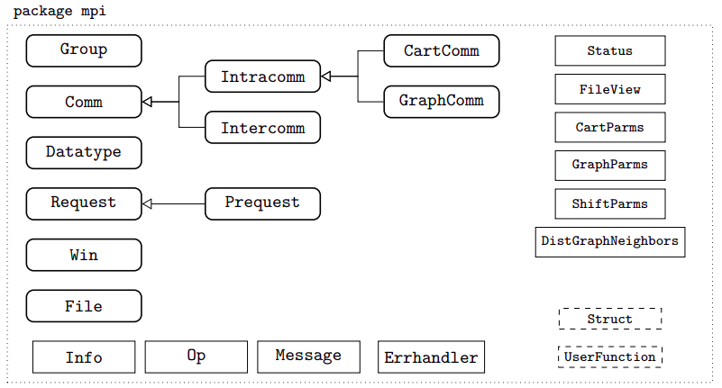

# Internal Implementation

### JNI Interface
The JNI interface serves as the crucial link between the Java runtime environment and native code. It allows Java applications to call functions written in C/C++ and vice versa. Within the Open MPI Java bindings, JNI serves as the gateway for Java methods to access the low-level MPI operations implemented in native code.

### Native Code
In the Open MPI Java bindings, native code written in C/C++ interfaces directly with the underlying Open MPI library. This native code handles fundamental MPI functionalities, such as process management, message passing, and synchronization. By interfacing with the native MPI library, the Java bindings can achieve optimal performance and leverage the full capabilities of MPI.

### Java Classes
The Java bindings define various Java classes to represent MPI entities, such as communicators, datatypes, and processes. These classes provide a high-level abstraction for Java developers to interact with MPI functionality. Through well-defined APIs, Java developers can perform common MPI operations using intuitive and familiar Java syntax.


_Fig. Class hierarchy of the Open MPI Java bindings. Main classes are depicted with rounded corners. Classes shown at the bottom are minor
classes defined by the MPI specification. Classes on the upper-right corner are used when a method returns structured information. The two classes depicted with dashed lines are abstract classes intended to be extended by the user._

### JNI Methods
Java methods that interact with the native MPI code are annotated with the `native` keyword, indicating that their implementation resides in native code. These methods serve as the entry points for invoking MPI operations from Java. When called, these methods delegate the actual MPI functionality to the corresponding native functions via JNI invocation.

### Error Handling
Error handling is critical in MPI applications to detect and recover from runtime errors gracefully. In the Open MPI Java bindings, mechanisms are in place to propagate errors from the native code back to the Java environment. By capturing and translating native MPI error codes into Java exceptions, developers can handle errors seamlessly within their Java applications.

```
try {
    File file = new File(MPI.COMM_SELF, "filename", MPI.MODE_RDONLY);
}
catch(MPIException ex) {
    System.err.println("Error Message: "+ ex.getMessage());
    System.err.println(" Error Class: "+ ex.getErrorClass());
    ex.printStackTrace();
    System.exit(-1);
}
```

### Resource Management
Efficient resource management is essential to prevent memory leaks and ensure optimal performance in MPI applications. Within the JNI implementation, mechanisms are employed to manage resources such as memory buffers, MPI communicators, and other system resources. Proper resource allocation and deallocation help optimize memory usage and ensure the efficient utilization of system resources.

### Memory Management
In Open MPI for Java, memory management involves navigating challenges posed by the absence of pointers and the intricacies of garbage collection (GC). While techniques like pinning and JNI functions offer real references to objects, they may lead to additional copies and hinder GC efficiency. 

Direct buffers strike a balance by reducing data copies while maintaining performance, though they require careful usage to avoid interfering with GC. Non-blocking methods specifically mandate direct buffers to ensure consistency across different offsets of arrays, emphasizing the importance of efficient memory management strategies to optimize performance in Java-based MPI applications.

### Thread Safety
MPI applications often involve concurrent execution by multiple threads. To ensure thread safety, the JNI implementation incorporates synchronization mechanisms to prevent concurrent access to MPI resources. By employing thread-safe constructs and synchronization primitives, the Java bindings maintain consistency and integrity when accessing shared MPI resources across multiple threads.
