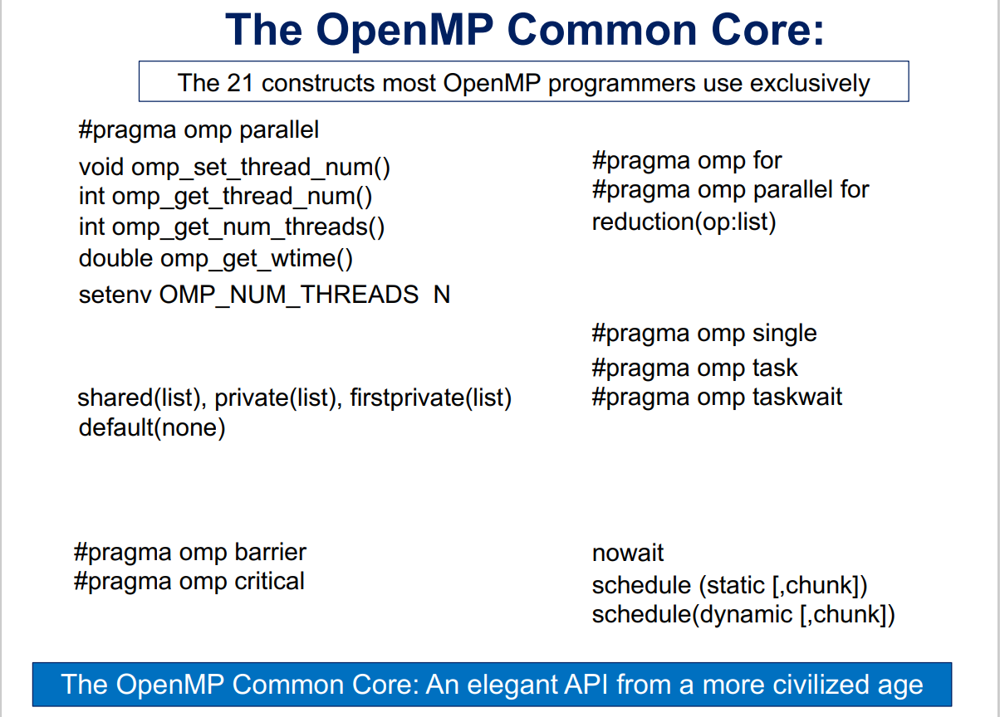

# Multithreaded Parallel Programming In Python

Python is not designed for parallel programming with threads, since its **Global Interpreter Lock (GIL)** prevents multiple threads from simultaneously accessing Python objects. This effectively prevents data races and makes Python naturally thread safe.

As a consequence, GIL prevents Python from accessing the full performance from a CPU.

**IDEA:** implement OpenMP in Python so programmers can easily annotate their code and then let the **Numba** just-in-time (JIT) compiler generate multithreaded, OpenMP code in LLVM, thereby bypassing the GIL.

**Goal:** Python is popular for its productivity, which often comes at the cost of performance. The goal is to give programmers the support of multithreading with the productivity of Python.
## Prior Approaches
1. A common approach in the HPC community has been to first write code in Python while developing new algorithms or workflows, and then reimplement it in a more performant language like C when actually deploying it.
2. Parallel accelerators (example: ParallelAccelerator in Numba), which exploits common patterns in code to expose concurrency which is then executed in parallel. The parallelism here is implicit in the patterns of code written by the programmer, which is powerful but it is not always possible to find sufficient concurrency needed to fully occupy the cores on a modern CPU.
3. Embedding parallelism in functions from modules such as Numpy. If the parallelism is constrained to the body of a function, then there is a startup overhead in launching the parallel threads and shutting them down for each function call, which adds up with each function call. 
	 This increases the fraction of a program execution time that is not reduced as parallel resources are added (the "serial fraction") and limits the maximum possible speedup (which is restricted by Amdahl’s law to one over the serial fraction).
	 Also, limiting parallelism to function bodies misses the additional parallelism that comes from running those functions in parallel.

The limitations in the approaches above indicate a need for explicit parallelism, and a Python toolchain to support it.
## PyOMP
A prototype system with support for OpenMP directives in Python. Directives in OpenMP are exposed using the Python `with` statement, which are interpreted by a custom Numba JIT compiler and combined with a backend that connects these constructs to analogous entry points in the generated LLVM code. Finally, this LLVM code is compiled using a LLVM system (such as Intel's LLVM system) which includes support for OpenMP.

The project is currently restricted to a subset of the 21 most commonly used elements of OpenMP, known as the *OpenMP common core*. More details can be found [here](https://www.openmp.org/wp-content/uploads/SC19-Mattson-Common-Core.pdf).

(Credit: [SC19-Mattson-Common-Core.pdf (openmp.org)](https://www.openmp.org/wp-content/uploads/SC19-Mattson-Common-Core.pdf))
